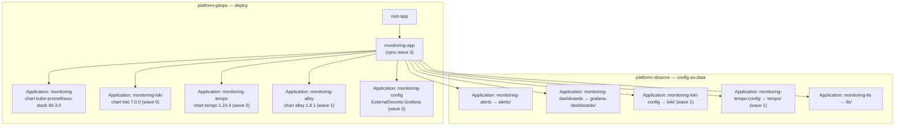
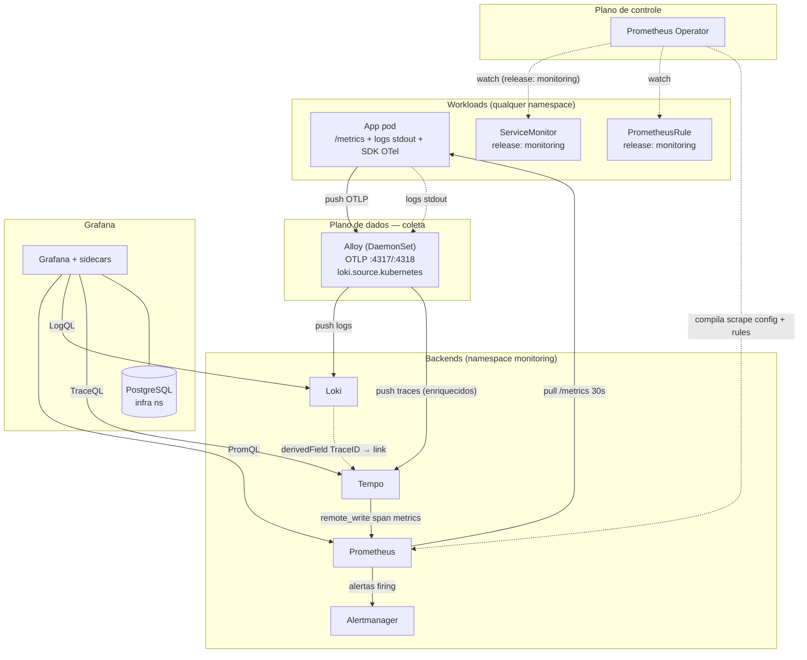
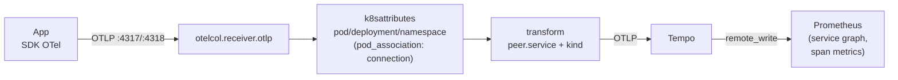
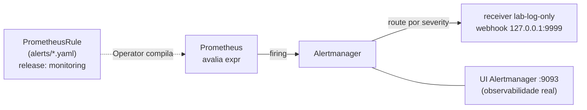

# Architecture — platform-observe

## Overview

Este repo guarda a **configuração-como-dado** do stack de observabilidade do
homelab: dashboards do Grafana, datasources, regras de alerta, roteamento do
Alertmanager e o certificado TLS dos ingresses. Não instala nada — só descreve
o que os componentes já rodando devem carregar.

Quem **instala** os componentes (Prometheus, Grafana, Alertmanager, Loki,
Tempo, Alloy) é o [`platform-gitops`](https://github.com/TourinhoM/platform-gitops),
via charts Helm em `apps/monitoring/`. Este repo é apontado por um conjunto de
Argo CD `Application`s (`monitoring-alerts`, `monitoring-dashboards`,
`monitoring-loki-config`, `monitoring-tempo-config`, `monitoring-tls`) que
sincronizam pastas daqui para o namespace `monitoring`.

A fronteira é deliberada: **o ciclo de vida do binário** (versão do chart,
sizing, storage) muda devagar e mora no gitops; **a configuração-como-dado**
(um alerta novo, um dashboard, um datasource) muda toda semana e mora aqui,
com PR e lint próprios sem tocar no deploy.

Três sinais, três mecanismos de coleta distintos — essa é a chave de leitura
de toda a arquitetura:

| Sinal | Como chega ao backend | Config por app |
|---|---|---|
| **Métricas** | Prometheus faz *pull* de `/metrics`; alvos descobertos pelo Operator via `ServiceMonitor` | `ServiceMonitor` com label `release: monitoring` |
| **Logs** | Alloy (DaemonSet) descobre todo pod via API do K8s e faz *push* pro Loki | nenhuma |
| **Traces** | app faz *push* OTLP pro Alloy, que enriquece e encaminha pro Tempo | instrumentar com SDK OTel |

Para reconstruir o stack do zero, contratos de label entre arquivos e
onboarding de uma app, ver [`docs/replicacao.md`](docs/replicacao.md). Este
documento cobre **por que** está montado assim e **como os componentes se
comunicam**.

---

## Quem entrega o quê (plano GitOps)

Dois repos colaboram via Argo CD. O `platform-gitops` é o app-of-apps âncora;
ele cria as `Application`s que instalam os charts **e** as que apontam pra cá.

Todas as `Application`s vivem no `platform-gitops` (`apps/monitoring/`),
mesmo as que sincronizam pastas deste repo. O `AppProject` `monitoring`
whitelista os dois repos mais os dois Helm registries como `sourceRepos`.

**Ordenação por sync-wave** resolve as dependências de boot:

| Wave | Sincroniza | Por quê nessa ordem |
|---|---|---|
| 0 | Loki, Tempo, ExternalSecrets do Grafana | backends e segredos antes de qualquer consumidor |
| 1 | Alloy, `loki/` e `tempo/` datasources | Alloy precisa do endpoint do Loki/Tempo de pé; datasource referencia UID do backend |
| 3 | `monitoring-app` (o app-of-apps de monitoring) | sobe depois que o stack base existe |

---

## Fluxo de comunicação em runtime

Setas sólidas = dados; tracejadas = controle (watch/geração de config). A
direção é **quem inicia** a conexão — distinção que importa porque métricas
são *pull* e logs/traces são *push*.

Leitura que mais confunde: **Prometheus nunca lê o `ServiceMonitor`.** Quem lê
é o Operator, que compila o `prometheus.yml` e injeta no Prometheus. Por isso
um `ServiceMonitor` sem o label `release: monitoring` falha silencioso — o
Operator o ignora e o Prometheus nem fica sabendo. Logs e traces não passam
pelo Operator: o Alloy descobre pods direto na API do K8s e recebe push OTLP.

### Tabela de comunicação componente a componente

| Origem | Destino | Protocolo / porta | Iniciador | Sinal |
|---|---|---|---|---|
| Prometheus | `/metrics` de cada alvo | HTTP scrape, 30s | Prometheus (pull) | métricas |
| Prometheus | Alertmanager | HTTP interno do stack | Prometheus | alertas firing |
| Tempo (metricsGenerator) | Prometheus | remote_write `:9090/api/v1/write` | Tempo (push) | span metrics / service graphs |
| App | Alloy | OTLP gRPC `:4317` / HTTP `:4318` | App (push) | traces |
| Alloy | Loki | HTTP `:3100/loki/api/v1/push` | Alloy (push) | logs |
| Alloy | Tempo | OTLP gRPC `:4317` | Alloy (push) | traces |
| Grafana | Prometheus / Loki / Tempo | HTTP query (PromQL/LogQL/TraceQL) | Grafana (pull) | leitura UI |
| Grafana | PostgreSQL (`infra` ns) | `:5432` | Grafana | estado do Grafana |

---

## Pipeline de enriquecimento de traces

O Alloy não é só um relay OTLP — ele faz três coisas que a app não precisa
saber: identifica o pod de origem, deriva o serviço destino e normaliza o
`span.kind`. Tudo via processadores OTTL antes de exportar pro Tempo.

O `k8sattributes` associa o span ao pod **pelo IP da conexão**
(`pod_association: from connection`), então a app não precisa carregar
`k8s.namespace`/`k8s.pod` no SDK — o Alloy enriquece. O `transform` deriva
`peer.service` a partir de `server.address` (FQDN → primeiro componente DNS,
hostname curto direto, IP+`rpc.method` conhecido → nome do serviço) e expõe
`kind` como atributo de span, porque o `grafana-exploretraces-app` 2.0.x
consulta `{span.kind="client"}` como atributo e não como intrínseco.

O Tempo roda `metricsGenerator` com `service-graphs` + `span-metrics` e faz
remote_write de volta pro Prometheus. É isso que alimenta as queries
`traces_spanmetrics_*` que o datasource Tempo usa em **Traces to Metrics**
(request rate, error rate, p95) — ver `tempo/tempo-datasource.yaml`.

---

## Fluxo de alertas

As regras (`alerts/gitops.yaml`, `postgres.yaml`, `keycloak.yaml`) são
`PrometheusRule` com label `release: monitoring`, casado pelo `ruleSelector`
do chart. O roteamento é um único `AlertmanagerConfig` (`lab-routing`) com
três rotas por severity (`critical`/`warning`/`info`) que, no lab, caem todas
no mesmo receiver stub. A observabilidade fica no UI do Alertmanager, não num
canal humano (ver decisão abaixo).

---

## Decisões de design

### Config-as-data separada do deploy

**Escolha:** dashboards, datasources, alertas e TLS moram neste repo;
charts/sizing/storage moram no `platform-gitops`.

**Alternativa:** tudo num repo só, com os valores de config embutidos nos
`values` Helm das `Application`s.

**Por quê:** as duas coisas mudam em ritmos diferentes. Um alerta ou dashboard
novo é PR semanal; subir versão do chart é raro e arriscado. Separar dá lint
e revisão próprios pra config sem destravar o deploy do binário.

**Custo:** uma `Application` Argo por pasta deste repo (cinco no total) e um
salto a mais de indireção — pra achar "onde mora o datasource do Loki" o
leitor passa pelo gitops (`monitoring-loki-config.yaml`) até chegar aqui.

### Alloy único pra logs e traces

**Escolha:** um DaemonSet Alloy coleta logs (`loki.source.kubernetes`) e
recebe traces (`otelcol.receiver.otlp`) no mesmo binário.

**Alternativa:** Promtail/Grafana Agent pra logs + um OpenTelemetry Collector
separado pra traces.

**Por quê:** um agente, um chart, um RBAC, um ponto de config. O Alloy cobre
os dois pipelines em Flow config e ainda faz o enriquecimento k8sattributes
que correlaciona trace↔pod sem a app cooperar.

**Custo:** acopla os dois sinais ao ciclo de vida de um DaemonSet — restart do
Alloy interrompe coleta de log e ingest de trace ao mesmo tempo. Em lab,
aceitável.

### Coleta de logs via API do K8s, não arquivo no node

**Escolha:** `loki.source.kubernetes` lê logs pela API do Kubernetes.

**Alternativa:** `loki.source.file` montando `/var/log/pods` do node no
DaemonSet.

**Por quê:** zero config de volume e funciona igual em qualquer runtime que a
API exponha. Onboarding de app nova pra logs é literalmente nada.

**Custo:** depende da API do K8s servir os logs. Runtime que não exponha logs
via API exigiria trocar pra `loki.source.file` + volumes (entra em
[limitações](#se-a-stack-mudar-viram-limitação)).

### Grafana persiste em PostgreSQL, não SQLite

**Escolha:** estado do Grafana (`grafana.ini.database`) num Postgres externo
no namespace `infra`, senha via `ExternalSecret`.

**Alternativa:** SQLite no PVC default do chart.

**Por quê:** SQLite trava o Grafana em single-replica e perde estado se o PVC
some. Apontar pro Postgres já existente do lab desacopla estado do pod.

**Custo:** Grafana ganha dependência de boot no Postgres e no ESO — se o
`grafana-db-credentials` não materializa, o pod não sobe. Mitigado por
sync-wave (ExternalSecrets na wave 0).

### Receiver `lab-log-only` em vez de `null`

**Escolha:** webhook pra um endpoint inexistente em loopback
(`127.0.0.1:9999`), `sendResolved: false`.

**Alternativa:** receiver `null` (vazio) do Alertmanager.

**Por quê:** o receiver `null` é silent — não deixa rastro. O webhook
loopback faz o Alertmanager logar a tentativa de delivery (audit trail em
`kubectl logs`) mantendo rastreabilidade "disparou → tentou notificar →
falhou esperado" sem custo de entrega real.

**Custo:** ruído de erro de delivery nos logs do Alertmanager — intencional,
mas precisa ser explicado pra quem lê o log pela primeira vez.

### Um Certificate multi-SAN pro namespace

**Escolha:** um `Certificate` (`monitoring-tls`) com todos os hosts do
namespace em `dnsNames`; ingresses do Grafana e Prometheus referenciam o mesmo
`secretName`.

**Alternativa:** um Certificate por host.

**Por quê:** adicionar um host novo (Alertmanager UI, Loki gateway) é um
append em `dnsNames` — cert-manager re-emite e o Traefik recarrega TLS sem
restart.

**Custo:** todos os hosts compartilham validade e rotação. Rotacionar um host
rotaciona todos.

---

## Limitações conhecidas

### Hoje, dentro do escopo atual

- Apps scaffoldadas nascem só com logs. O skeleton não inclui `ServiceMonitor`
  nem instrumentação OTel; onboarding de métricas/traces é manual
  (ver [`docs/replicacao.md`](docs/replicacao.md)).
- O `postStart` do Grafana patcheia o plugin `grafana-exploretraces-app` via
  `sed` (workaround da versão 2.0.x). Sensível a upgrade do plugin — definido
  em `platform-gitops/apps/monitoring/monitoring.yaml`.
- Single-replica em tudo (Prometheus, Loki, Tempo, Alertmanager), retenção de
  7d de métricas e 24h–168h de traces/logs. Sizing de homelab, não de produção.
- Alertmanager sem receiver externo: nada faz paging. Os três routes por
  severity caem no mesmo stub log-only — viram receivers reais (PagerDuty/
  Slack/email) sem mudar o resto da arquitetura.

### Se a stack mudar, viram limitação

- Coleta de logs usa `loki.source.kubernetes` (API do K8s). Runtime que não
  exponha logs via API exigiria trocar pra `loki.source.file` + volumes no
  DaemonSet.
- `peer.service` é derivado por regex sobre `server.address` no Alloy. Padrões
  de endpoint que fujam dos três formatos cobertos (FQDN, hostname curto,
  IP+`rpc.method` conhecido) não materializam aresta no service graph até
  ganharem uma regra no `transform`.
- Storage filesystem local em Loki e Tempo. Migrar pra retenção maior ou
  multi-réplica exige object store (S3/GCS) e sair do modo SingleBinary/local.
