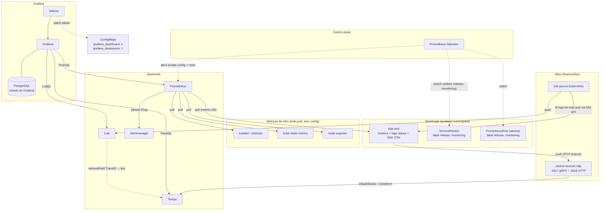
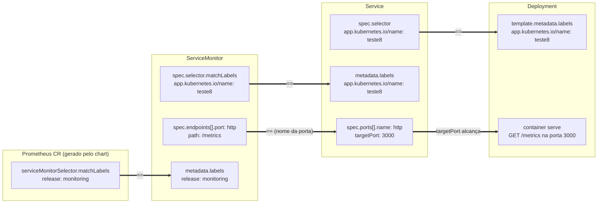

# Replicar o stack de observabilidade em outro ambiente

Guia pra reconstruir o stack (métricas + logs + traces + dashboards versionados)
num cluster novo. Tudo é entregue via Argo CD; nenhum componente é instalado à mão.

## Service map

Setas sólidas = dados. Setas tracejadas = controle (watch/geração de config).
A direção indica quem inicia a comunicação (pull vs push).

Leituras importantes do mapa:

- **Prometheus nunca lê ServiceMonitor.** Quem lê é o Operator, que compila o
  `prometheus.yml`. Por isso um ServiceMonitor sem o label `release: monitoring`
  falha silencioso: o Operator o ignora e o Prometheus nem fica sabendo.
- **Métricas de infra ≠ métricas da app.** CPU/memória de qualquer pod chegam
  via cAdvisor/kube-state-metrics sem nenhuma config. Um pod aparecer em
  dashboard de recursos não prova que o `/metrics` dele está sendo coletado —
  verificar com `up{namespace="<ns>"}`.
- **Logs e traces não passam pelo Operator.** Alloy descobre pods direto na
  API do K8s (logs) e recebe push OTLP (traces). Só métricas dependem da
  cadeia ServiceMonitor → Operator → Prometheus.

Três sinais, três mecanismos distintos:

| Sinal | Mecanismo | Config por app |
|---|---|---|
| Logs | Alloy descobre todo pod do cluster via API | nenhuma |
| Traces | app envia OTLP pro Alloy (`:4317` gRPC, `:4318` HTTP); Alloy identifica o pod pelo IP da conexão | instrumentar com SDK OTel |
| Métricas | Prometheus Operator + ServiceMonitor | ServiceMonitor com label `release: monitoring` |

## Pré-requisitos

| Dependência | Por quê |
|---|---|
| Argo CD com projeto `monitoring` | todos os componentes são `Application`s |
| External Secrets Operator | secrets `grafana-admin-credentials` e `grafana-db-credentials` |
| PostgreSQL acessível | Grafana persiste em Postgres (`grafana.ini.database`), não em SQLite |
| cert-manager | `monitoring-tls` (TLS dos ingresses Grafana/Prometheus) |
| Repos `platform-gitops` e `platform-observe` acessíveis pelo Argo | definição do stack e configs versionadas |

## Componentes e onde vivem

| Componente | Chart / versão | Definição |
|---|---|---|
| kube-prometheus-stack | `84.3.0` | `platform-gitops/apps/monitoring/monitoring.yaml` |
| Loki | `7.0.0` | `platform-gitops/apps/monitoring/monitoring-loki.yaml` |
| Tempo | `1.24.4` | `platform-gitops/apps/monitoring/monitoring-tempo.yaml` |
| Alloy | `1.8.1` (sync-wave 1) | `platform-gitops/apps/monitoring/monitoring-alloy.yaml` |
| Dashboards, datasources, alertas, TLS | — | `platform-observe/` (apontado pelas Applications `monitoring-*`) |

## Passos

1. **Secrets primeiro.** Criar no backend de secrets (e os `ExternalSecret`s
   correspondentes): `grafana-admin-credentials` (chaves `admin-user`,
   `admin-password`) e `grafana-db-credentials` (`GF_DATABASE_PASSWORD`).
   Criar o database `grafana` no Postgres com o user correspondente.
2. **Ajustar endpoints.** Os values referenciam serviços por FQDN do cluster
   (`postgresql.infra.svc...`, `monitoring-loki.monitoring.svc...`). Se a
   topologia de namespaces mudar, atualizar em `monitoring.yaml` (Grafana → DB)
   e `monitoring-alloy.yaml` (loki.write).
3. **Ajustar hosts dos ingresses.** `grafana.local` e `prometheus.local` nos
   values + `monitoring-tls` em `platform-observe/tls/`.
4. **Sync.** Aplicar o app-of-apps de monitoring
   (`platform-gitops/apps/monitoring-app.yaml`). A ordem é resolvida por
   sync-wave: stack → Loki/Tempo → Alloy → configs.
5. **Validar:** Grafana abre com datasources Loki/Tempo/Prometheus; logs de
   qualquer pod aparecem no Loki sem config; `up{job=...}` dos ServiceMonitors
   existentes retorna 1.

## Onboarding de uma app nova

- **Logs:** nada a fazer. O label `app` no Grafana vem de
  `app.kubernetes.io/name` do pod — padronizar esse label.
- **Métricas:** expor `/metrics`, criar `Service` com porta nomeada `metrics`
  e um `ServiceMonitor` com `labels.release: monitoring`. Sem esse label o
  Prometheus ignora o monitor silenciosamente (comportamento default do chart,
  `serviceMonitorSelectorNilUsesHelmValues: true`). Exemplo funcional:
  `platform-data/k8s/base/servicemonitor-postgresql.yaml`.
- **Traces:** SDK OTel exportando pra
  `monitoring-alloy.monitoring.svc.cluster.local:4317`. Namespace/deployment
  são enriquecidos pelo Alloy; a app não precisa se identificar.
- **Dashboard:** JSON em `platform-observe/grafana-dashboards/` + entrada no
  `configMapGenerator`. O kustomization aplica `grafana_dashboard: "1"`
  (sidecar do Grafana carrega) e `disableNameSuffixHash: true` (nome estável,
  senão o Argo recria ConfigMap a cada mudança e o sidecar duplica).
  Datasources seguem o mesmo padrão com label `grafana_datasource: "1"`.

## Contratos de configuração

O que precisa **bater entre arquivos diferentes** pra cada sinal funcionar.
Cada seta `==` é um par de campos que deve ser idêntico; quebrar qualquer um
falha sem mensagem de erro.

### Métricas (a cadeia com mais contratos)

Atenção ao contrato mais confundido: `ServiceMonitor.spec.selector` casa com os
**labels do Service** (`metadata.labels`), não com o selector do Service. São
dois conjuntos de labels distintos no mesmo Service.

| # | Lado A | Lado B | Sintoma se divergir |
|---|---|---|---|
| 1 | `Service.spec.selector` | labels do pod template | Service sem Endpoints; nada alcança o pod |
| 2 | `ServiceMonitor.spec.selector.matchLabels` | `Service.metadata.labels` | job existe com 0 targets |
| 3 | `ServiceMonitor.spec.endpoints[].port` | `Service.spec.ports[].name` | target não materializa (porta por nome não resolve) |
| 4 | `ServiceMonitor.metadata.labels.release` | `Prometheus.spec.serviceMonitorSelector` (`release: monitoring`) | Operator ignora o SM; job nem aparece na config (caso real: teste8) |
| 5 | `endpoints[].path` (`/metrics`) | rota servida pela app | `up == 0`, scrape 404 |

Diagnóstico por camada: contrato 4 quebrado → job ausente em
`/api/v1/status/config`; 2-3 → job presente, targets vazios; 5 → target
presente, `up == 0`.

### Demais sinais (contratos pontuais)

| Sinal | Lado A | Lado B | Sintoma se divergir |
|---|---|---|---|
| Alertas | `PrometheusRule.metadata.labels.release: monitoring` | `Prometheus.spec.ruleSelector` | alerta nunca avaliado, silencioso |
| Dashboards | label `grafana_dashboard: "1"` no ConfigMap (gerado pelo kustomization) | config do sidecar do Grafana (default do chart) | dashboard não carrega |
| Dashboards | `disableNameSuffixHash: true` | — | sem ele, cada mudança gera ConfigMap novo e o sidecar duplica dashboards |
| Datasources | label `grafana_datasource: "1"` | sidecar de datasources | datasource não aparece |
| Log→trace | `derivedFields.datasourceUid: tempo` (datasource Loki) | `uid` do datasource Tempo | link de TraceID no log quebra |
| Logs | label `app.kubernetes.io/name` no pod | regra de relabel do Alloy (`target_label: app`) | logs chegam sem o label `app`, queries por app falham |
| Traces | endpoint OTLP no SDK da app | `extraPorts :4317` + Service do Alloy | spans descartados na origem |
| Traces | `loki.write.url` / forward do Alloy | FQDN dos Services Loki/Tempo | coleta morre se namespace/nome mudar |
| Grafana | `admin.existingSecret: grafana-admin-credentials` (chaves `admin-user`/`admin-password`) | chaves geradas pelo ExternalSecret | pod não sobe |
| Grafana | `$__env{GF_DATABASE_PASSWORD}` no grafana.ini | env injetada por `envFromSecrets: grafana-db-credentials` | Grafana não conecta no Postgres |

## Limitações conhecidas

### Hoje, dentro do escopo atual

- Apps scaffoldadas nascem só com logs: o skeleton não inclui ServiceMonitor
  nem instrumentação OTel. Onboarding de métricas/traces é manual (seção acima).
- O `postStart` do Grafana patcheia o plugin `grafana-exploretraces-app` via
  `sed` (workaround pra versão 2.0.x). Sensível a upgrade do plugin — se o
  Grafana subir com plugin atualizado, revisar ou remover o hook em
  `monitoring.yaml`.
- Single-replica em tudo (Prometheus, Loki, Tempo, Alertmanager) e retenção
  de 7d/5Gi — sizing de homelab, não de produção.

### Se a stack mudar, viram limitação

- A coleta de logs usa `loki.source.kubernetes` (API do K8s), não arquivos no
  node. Runtime que não exponha logs via API exigiria trocar pra
  `loki.source.file` + volumes no DaemonSet.
- Alertmanager sem receiver externo configurado neste repo; integração com
  e-mail/chat é etapa própria.
